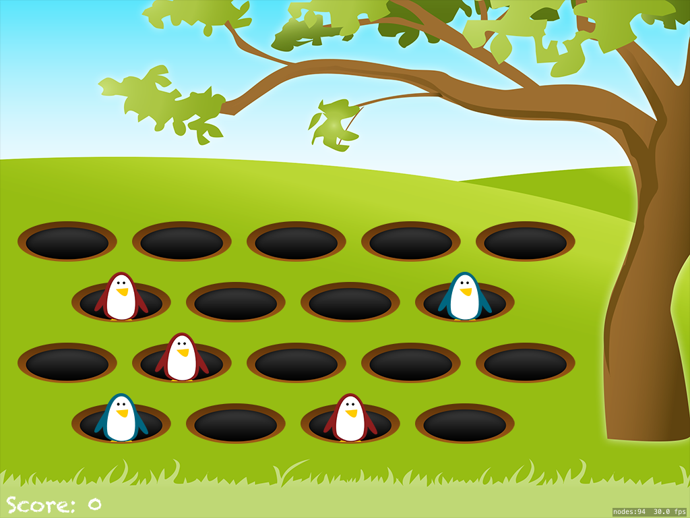

# Whack-A-Penguin
Repo following Project 14: Whack-A-Penguin at hackingwithswift.com.  The goal of this project is to learn about SKCropNode and SKTexture to build an interactive game where the sprites respond to touch events.



## Concepts Learned/Practiced
* SKCropNode
* SKTexture
* SKAction
  * ```SKAction.waitForDuration()``` - waits a specified period of time
  * ```SKAction.runBlock()``` - runs code we specify, provided its in a closure
  * ```SKAction.sequence()``` - takes an array of actions and runs through them in order
* Grand Central Dispatch
  * ```dispatch_time()``` to create time delays
  * ```dispatch_after()``` to schedule a closure after time delay has been reached.
* More practice with closures
* More practice using property observers
* Using GameplayKit to shuffle array of objects
* Forcing method parameter labels:
  * Example from project:

  ```swift
  func show(hideTime hideTime: Double) {
    if visible { return }

    charNode.runAction(SKAction.moveByX(0, y: 80, duration: 0.05))
    visible = true
    isHit = false

    if RandomInt(min: 0, max: 2) == 0 {
        charNode.texture = SKTexture(imageNamed: "penguinGood")
        charNode.name = "charFriend"
    } else {
        charNode.texture = SKTexture(imageNamed: "penguinEvil")
        charNode.name = "charEnemy"
    }
}

  ```
  * By default, the first parameter in a method doesn't have a label.  Therefore, we have to explicitly give it a name and in the code here, it is just more descriptive with a named parameter.

## Attributions
[Project 14: Whack-a-Penguin: SKCropNode and SKTexture @ hackingwithswift.com](https://www.hackingwithswift.com/read/14/overview)
